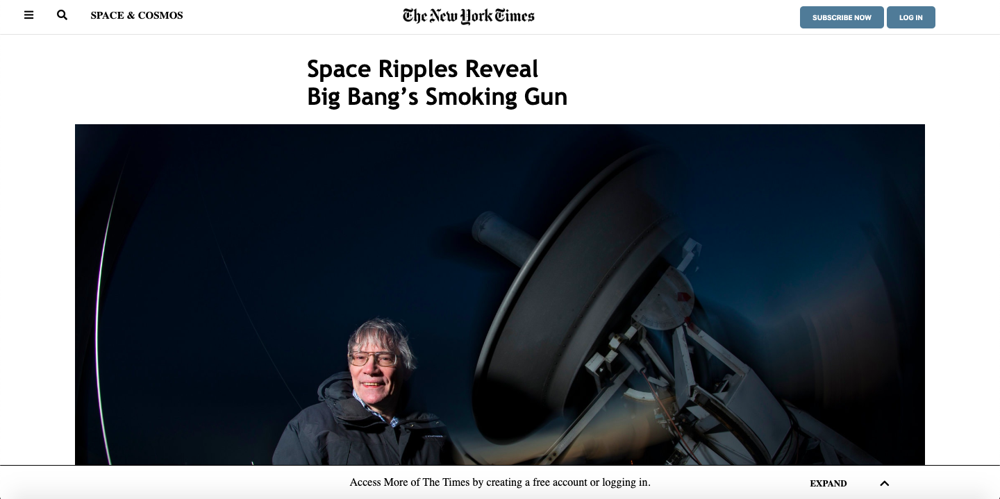

# HTML forms

> This is the third project of the Microverse.

## Live link

https://raw.githack.com/afcastaneda223/Microverse-3rd-project-Andres/master/index.html

Positioning and floating elements.

## Built With

- HTML,
- CSS,

## GitHub Repo

https://github.com/afcastaneda223/Microverse-3rd-project-Andres

## Authors

👤 **Andres Felipe Castañeda Ramos**

- Github: [@afcastaneda223](https://github.com/afcastaneda223)
- Twitter: [@afcastaneda](https://twitter.com/afcastaneda)
- Linkedin: [Andres Felipe Castañeda](www.linkedin.com/in/andres-castaneda223)

## Show your support

Give a ⭐️ if you like this project!

## Acknowledgments

- Microverse
- Everyone else

## 📝 License

Distributed under the MIT License. See `LICENSE` for more information.
